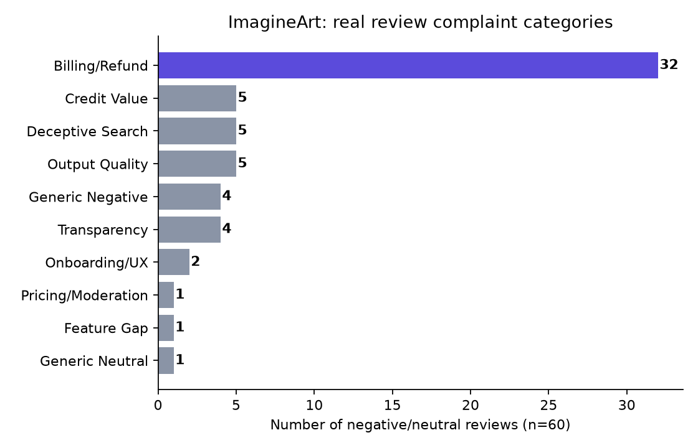

# ImagineArt Checkout & Cancellation Clarity — A Product Case Study

**TL;DR:** I analyzed 100 real, public customer reviews of ImagineArt (a generative-AI creative platform) and found that over half of all negative reviews — 53.3% — come down to one fixable problem: people don't understand what they're being charged, or how to cancel. This repo contains the full analysis, the product requirements document (PRD) for a fix, a proposed A/B test to validate it, and all the code used to collect and analyze the data.

> This is an independent, self-directed practice project. It is **not affiliated with ImagineArt or its parent company, Vyro**. I built it to practice real product-management methodology — the same process a product or growth team would use — on real, publicly available data.

---

## Why I built this

I'm applying for Associate Product Manager / Growth roles, and I wanted to show, not just claim, that I can do the actual job: find a real problem using real evidence, write a clear hypothesis, define success metrics, and design a way to test it.

Rather than use a textbook dataset, I picked a real company's real public customer feedback and worked through it exactly as I'd do on the job.

---

## The headline finding

Of 100 scraped reviews, 60 were negative or neutral (3 stars or below). I read every single one and manually categorized it (a keyword script made a first guess; I corrected every row by hand). The result:



**53.3% of negative reviews (32 of 60) are billing or cancellation complaints** — more than triple the next-largest category.

Digging further, those 32 complaints split into five distinct sub-problems — some fixable by a product/UX change, some needing a policy or legal owner instead. The full breakdown is in `problem and hypothesis.md`.

---

## How I got there (the real process)

1. **Collected real data.** Scraped reviews from ImagineArt's public Trustpilot page using Python (`requests` + `BeautifulSoup` — see `scrape reviews.py`). When Trustpilot's bot-protection blocked automated requests, I used a fallback: saved the pages manually (`page1.html` through `page5.html`) and parsed them with `parse saved html.py` — same extraction logic, different source.
2. **Categorized every review by hand.** `categorize reviews.py` made a first-pass keyword guess at each review's category; I then read all 100 myself and corrected every row, including several the script got wrong.
3. **Found the pattern, checked it against a competitor.** Billing/Refund was the dominant category. I compared ImagineArt's refund policy to a direct competitor's (OpenArt) and found ImagineArt's policy is actually *more* generous — which ruled out "loosen the policy" as the fix and pointed to **clarity**, not leniency, as the real problem.
4. **Wrote a hypothesis** — a specific, falsifiable prediction — scoped honestly to only the parts of the problem a product fix can actually solve.
5. **Wrote a full PRD**: problem, goals, success metrics (including guardrails), user stories, and an explicit list of open questions and dependencies I'd need to resolve with a real team before this could ship.
6. **Designed a proposed A/B test** (`ab test sample size.py`), including real statistics — required sample size and significance testing — clearly labeled as a *design*, not a result, since I don't have access to ImagineArt's production systems.
7. **Mapped the wider growth funnel** (acquisition, activation, retention, referral) in `Funnel Opportunity.md`, honestly rating how strong the evidence was for each stage.

---

## What's in this repo

| File | What it is |
|---|---|
| `README.md` | This file |
| `problem and hypothesis.md` | The evidence, the 5 sub-patterns, the hypothesis, competitive check |
| `PRD.md` | The full product requirements document |
| `Experiment Design.md` | Proposed A/B test: metrics, sample size, decision framework |
| `Funnel Opportunity.md` | Acquisition/activation/retention/referral opportunities, evidence-graded |
| `chart_complaint_categories.png` | The chart behind the headline finding |
| `categorized_reviews.csv` | The real, hand-corrected dataset behind every number in this project |
| `raw_reviews.csv` | The raw scraped data, before categorization |
| `page1.html` – `page5.html` | The real Trustpilot pages used as the data source (saved locally after live scraping was blocked — see `parse saved html.py`) |
| `scrape reviews.py` | Live scraper (requests + BeautifulSoup) |
| `parse saved html.py` | Fallback scraper, reads the saved `page*.html` files |
| `categorize reviews.py` | First-pass keyword categorizer |
| `analyze.py` | Turns the categorized data into the chart + summary stats |
| `ab test sample size.py` | Real sample-size & significance-test statistics for the proposed experiment |

**If you only read one file, read `PRD.md`.** It links out to everything else.

---

## For non-technical readers

You don't need to touch any code to understand this project. Start with:
1. The **headline finding** above (the chart).
2. `problem and hypothesis.md` — what the problem actually is, in plain English.
3. `PRD.md` — what I'd propose doing about it.

## For technical readers

Run the pipeline yourself, in order:
```
pip install requests beautifulsoup4 pandas matplotlib scipy
python "scrape reviews.py"        # or "parse saved html.py" if blocked
python "categorize reviews.py"
python analyze.py
python "ab test sample size.py"
```

---

## Tech stack

**Python** (`requests`, `beautifulsoup4`, `pandas`, `matplotlib`, `scipy`) for data collection, analysis, and statistics · **Markdown** for documentation · manual qualitative coding for categorization · **Git/GitHub** for version control.

---

## Honesty notes — what this project is, and isn't

- The review data is 100% real and independently verifiable — the raw HTML source pages are included in this repo.
- The A/B test in `Experiment Design.md` is a **proposed design**, not a result. I do not have access to ImagineArt's production systems or user base, and the documents say so explicitly rather than implying otherwise.
- The competitive check used public policy pages, not internal data.

I'd rather this project be smaller and entirely true than impressive and partly fabricated.

---

## Skills demonstrated

Real-world data collection (web scraping with a documented fallback plan) · qualitative coding and pattern-finding · competitive analysis · hypothesis writing · PRD authorship (problem, goals, guardrail metrics, user stories, scope, open questions) · A/B test design (sample size calculation, statistical significance) · growth-funnel analysis.

---

## About

Built by **Mairaj Fatima** — BI Associate, data analyst, and aspiring Product Manager.
[GitHub](https://github.com/mairajfatima) · [LinkedIn](https://linkedin.com/in/mairaj-fatima-62207a310)

Feedback welcome — if you work in product, growth, or billing UX and see something I've missed, please open an issue.
